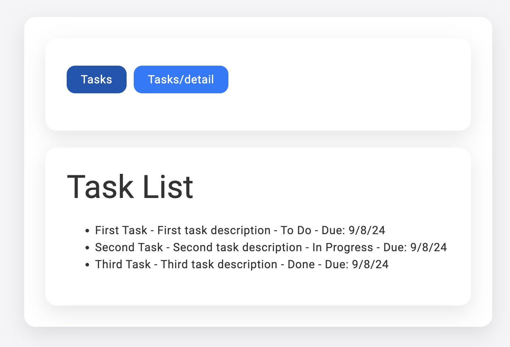
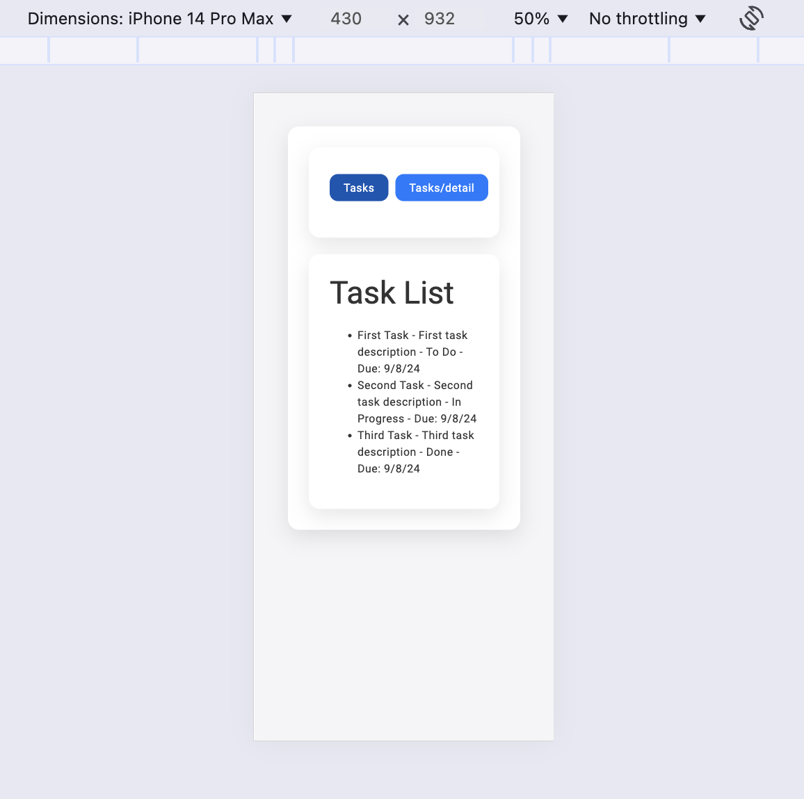
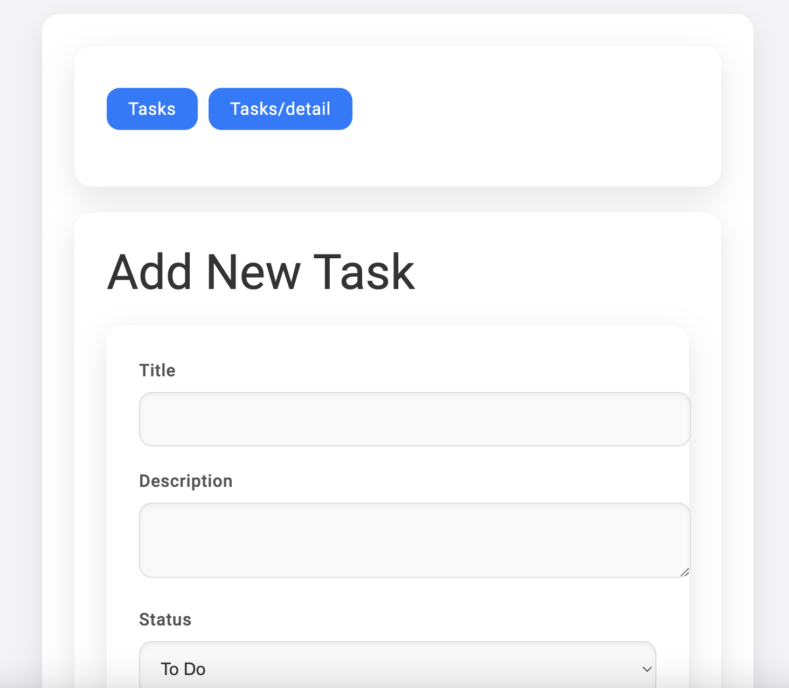
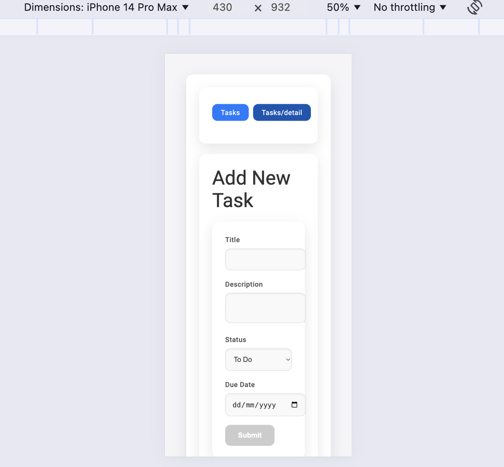

# TaskmasterDashboard

TaskmasterDashboard is a minimalist Angular application designed for managing tasks. The project showcases modern Angular development techniques and best practices, making it an ideal reference for developers looking to enhance their Angular skills.

This project was generated with [Angular CLI](https://github.com/angular/angular-cli) version 18.0.4.

## Features
- **Task Management**: Create, update, and delete tasks.
- **State Management**: The app uses BehaviorSubject for managing task state, ensuring efficient data handling without relying on local storage.
- **Lazy Loading**: The TasksModule is lazily loaded, optimizing the initial load time and improving overall performance.
- **Responsive Design**: A clean, modern UI with a responsive layout using CSS flexbox and media queries, designed to look great on any device.
- **Dynamic Navigation**: A navigation field that dynamically lists routes while excluding dynamic paths, ensuring a clean user experience.
- **Error Handling**: Implemented proper error handling for asynchronous operations, including network requests.
- **Component-Based Architecture**: Small, reusable components were created, adhering to Angular’s component-based architecture.
- **Typography & Design**: A modern, minimalist design inspired by Apple’s aesthetic, focusing on simplicity and usability.

## Screenshots

## Development server

Run `ng serve` for a dev server. Navigate to `http://localhost:4200/`. The application will automatically reload if you change any of the source files.

## Code scaffolding

Run `ng generate component component-name` to generate a new component. You can also use `ng generate directive|pipe|service|class|guard|interface|enum|module`.

## Build

Run `ng build` to build the project. The build artifacts will be stored in the `dist/` directory.

## Running unit tests

Run `ng test` to execute the unit tests via [Karma](https://karma-runner.github.io).

## Best Practices

- **Component-Based Architecture**: Angular’s component-based architecture promotes modularity and reusability. Each component is responsible for a specific part of the UI, making it easier to maintain and update.

- **State Management**: Used BehaviorSubject for managing task state, avoiding reliance on localStorage.

- **Lazy Loading**: The TasksModule is configured for lazy loading to improve the app’s performance.

- **Responsive and Minimalist Design**: Consistent use of modern, minimalist design principles with responsive layouts to ensure the application is accessible and user-friendly across devices.

- **Dynamic Navigation**: Created a nav-field component that dynamically lists routes, excluding paths with dynamic parameters like :id.

- **Error Handling**: Implemented error handling for asynchronous operations to ensure smooth user experience.

- **Use of trackBy in ngFor Directives**: Implemented the trackBy function to optimize rendering of lists in Angular.

- **Component-Based Architecture**: Created small, reusable components that follow Angular’s best practices for maintainability and scalability.

- **Typography & Aesthetics**: Applied modern typography and clean design, focusing on enhancing readability and overall user experience.

## Further help

To get more help on the Angular CLI use `ng help` or go check out the [Angular CLI Overview and Command Reference](https://angular.dev/tools/cli) page.
